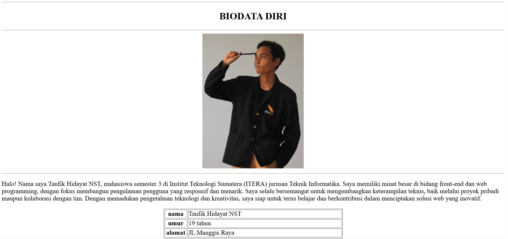

👋 Biodata Diri HTML Sederhana
 

Sebuah proyek tugas untuk mendemonstrasikan pembuatan halaman web biodata pribadi yang informatif dan terstruktur dengan menggunakan <strong>HTML murni</strong> tanpa CSS.

🖼️ Tampilan Halaman & Tautan Langsung

 
<b>Klik gambar untuk mengunjungi halaman web</b>
   

  
 

✨ Fitur Utama
Proyek ini, meskipun sederhana, mencakup beberapa elemen fundamental HTML:

✅ Paragraf Perkenalan: Deskripsi singkat mengenai latar belakang dan minat.

✅ Tabel Informasi: Biodata ringkas disajikan dalam <table> agar rapi.

✅ Daftar Riwayat & Favorit: Menggunakan Unordered List (<ul>) untuk riwayat pendidikan dan Ordered List (<ol>) untuk daftar film favorit.

✅ Integrasi Media: Menampilkan foto profil () dan tautan eksternal (<a>) ke media sosial.

✅ Struktur Semantik: Penggunaan tag seperti 
, <h3>, dan 
 untuk menata konten secara visual tanpa CSS.

🛠️ Teknologi yang Digunakan
Proyek ini dibangun sepenuhnya dengan teknologi dasar web:

🚀 Cara Menjalankan
Tidak ada proses instalasi yang diperlukan. Cukup ikuti langkah-langkah ini:

Clone atau Unduh Repositori

git clone https://github.com/NAMA_USER_ANDA/NAMA_REPO_ANDA.git

Navigasi ke Direktori

cd NAMA_REPO_ANDA

Buka File HTML

Buka file index.html (atau nama file HTML utama Anda) langsung di peramban web favorit Anda.

Pastikan file gambar foto_respect.JPG berada di folder yang sama.

👤 Hubungi Saya
Mari terhubung!

